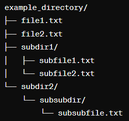
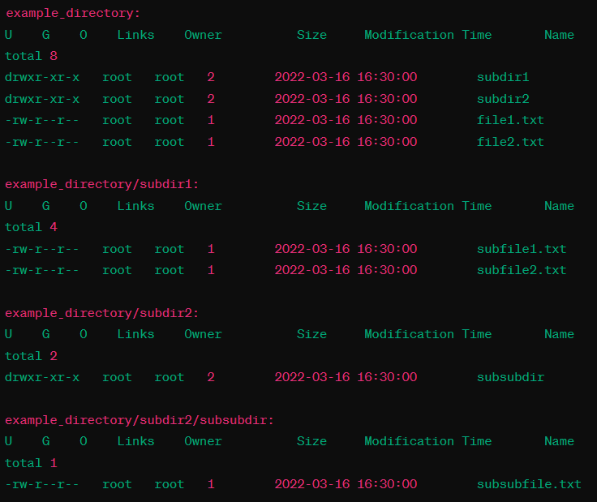

# Directory Listing Program

## Description

This C program lists the contents of a directory, including files and subdirectories, along with their permissions, ownership, size, modification time, and name. It provides an option to list the contents of subdirectories recursively.

## Features

- Lists the contents of a directory.
- Displays file permissions (user, group, and others), ownership, size, modification time, and name.
- Supports listing subdirectories recursively.

## Usage

Compile the program using a C compiler such as `gcc`:

#bash
gcc -o list_dir list_dir.c

Run the compiled program with an optional -R flag to list the contents of subdirectories recursively:

./list_dir            # Lists contents of current directory
./list_dir -R         # Lists contents of current directory and subdirectorie

##Example

Suppose we have the following directory structure:

 
 
Running the program in the example_directory would produce output similar to the following:
 
 
